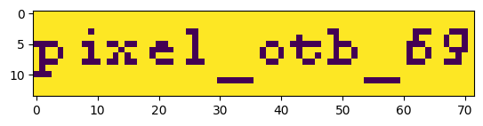

# Nokia is calling
Write-Up by @PHPCore

## Description
So you have a very security-concerned friend who does not like any smartphones and only uses his original Nokia phone. He constantly receives some secret SMS, but you've never figured out what he got, as when he showed you his messages, no new texts were there. One day, you decide to whip out our old HackRF and sniff all GSM traffic until your friend receives another SMS. After some fiddling with the signals, you recover three SMS messages, which you'll find attached. Can you extract the secret message sent to your friend? \
Flagformat: string which has to be put in dach2025{<string>}

## Research
We can see two important pieces of information in the challenge description and name: it is about Nokia and it is about SMS/GSM. If we look into the attached file called sms.txt, we will see the following (I trimmed the messages, because it’s not relevant for the general format): 
```
//SCKL1583 0B05041583000000030103013000480E01...
//SCKL1583 0B050415830000000301030273DFFCC18...
//SCKL1583 0B0504158300000003010303FFFFFFFC0...
```

We see three lines of text, which all start with a double slash and a descriptor (SCKL1583) followed by a space and data encoded as hexadecimal. We can also see a shared pattern at the start of the encoded data. My best guess was to search the web for the descriptor, which is what I did and where I found [SMS-Solutions](https://www.smssolutions.net/tutorials/smart/sckl/). This website explains everything about the protocols packet structure. For us this results in:
 * Magic: //SCKL
 * Destination-Port: 1583
 * Source-Port: 0B05
 * Message-Reference: 0415830000000 (This should just be 2 Bytes according to specification, but I didn't know where the other bytes belonged to, so I assumed that they are part of this, because this wont affect the challenge)
 * Number of Segments: 03
 * Number of this Segment: 01 or 02 or 03
 * User-Data: x-Bytes

The destination port 1583 is defined as the Group-Logo service. This gives us a clue about the user-data, which is defined as: A 72x14 pixel, black & white icon. \
Another important piece of information we need later on, is that the user-data starts with 3000480E01, which we need later on. What we are missing now is the knowledge about what exactly the format of the image data is. I tried entering multiple different search queries on Google, which were all different expressions of “Nokia icon file format”, until I found the right one: “nokia file format black white icon”, which brought me to the Wikipedia-Article of [OTA-Bitmap](https://en.wikipedia.org/wiki/OTA_bitmap). This is the file-format Nokia uses for over-the-air image transfers, which is exactly what we need. In the article it mentions, that we have an image header consisting of:
 * Magic-Byte (0x00)
 * Image-Width (0x48 required for our use-case where width should be 72)
 * Image-Height (0x0E required for our use-case where height should be 14)
 * Color-Space (0x01)

We can also see this in our user-data after the first byte (30), which I just omitted in my analysis. The image-header is followed by row-oriented, raw bits, where `white = 0` and `black = 1`. Now we know everything to implement a proper reader, for the Group-Logo.
## Solution
My implementation consists of three parts:
* Extract user-data from *sms.txt*
* Parse the image-data
* Render the image-data

The extraction of the user-data is relatively simple:\
Reading all lines from *sms.txt*, omit the packet-header bytes, join user-data together and omit the first byte (30), to get the relevant payload:
```python
lines = None

with open('./sms.txt') as f:
    lines = f.readlines()

messages = list(map(lambda x: x.split(' ')[1][24:], lines))
complete_payload = ''.join(messages)
data = bytes.fromhex(complete_payload)
data = data[1:]
``` 

We will now parse the image-data, which consists of parsing the header and converting our row-oriented and raw bits into an image-matrix. I also added assertions just for debugging while I tested around:
```python
import numpy as np
import struct

magic_byte, image_width, image_height, color_space = struct.unpack('>BBBB', data[:4])
image_data = data[4:]

assert magic_byte == 0x00, 'Invalid magic byte'
assert color_space == 0x01, 'Invalid color space'

img = np.zeros((image_height, image_width, 1), dtype=np.uint8)

for row in range(image_height):
    for col in range(image_width):
        val = image_data[row * image_width // 8 + col // 8] & (1 << (7 - col % 8))
        img[row, col, 0] = 255 if val != 0 else 0
```

Now we just need to render our image-matrix and voila:
```python
import matplotlib.pyplot as plt

plt.imshow(img, interpolation='nearest')
plt.show()
```


We now just need to wrap it up into the flag format and we can enter it on the CTF-Platform as: `dach2025{pixel_otb_69}`
## Patching the Vulnerability
As mentioned in the challenge description, this was achieved by sniffing on the GSM RF-Spectrum and waiting for the packets, which means that the traffic was unencrypted. So the most effective way of mitigating this type of attack, would be to implement E2E-Encryption, between sender and receiver. This would result in the attack just receiving useless data. The recommended way would be to use TLS for this, but this would require to define a new protocol. Which is why the easiest way to realize this, would be to apply encryption to the transferred file. When we again read the specs mentioned by [SMS-Solutions](https://www.smssolutions.net/tutorials/smart/sckl/), it doesn’t specify a file format to use. So we could change the start-byte (30), which is assume to be a file-type indicator, to another byte, which will now indicate our encrypted file-format. The following process would require an established PKI. We base our new file-format on the OTA-Bitmap, but encrypt the image-data using a randomly generated AES-Key. We append the AES-Key encrypted using the public-key of the receiver at the end, so only the receiver can decrypt the image. Do not use AES-ECB, because it might leave traces of the original image. This will ensure encrypted delivery without the need for a new protocol. (This idea, is still missing authenticity checks)